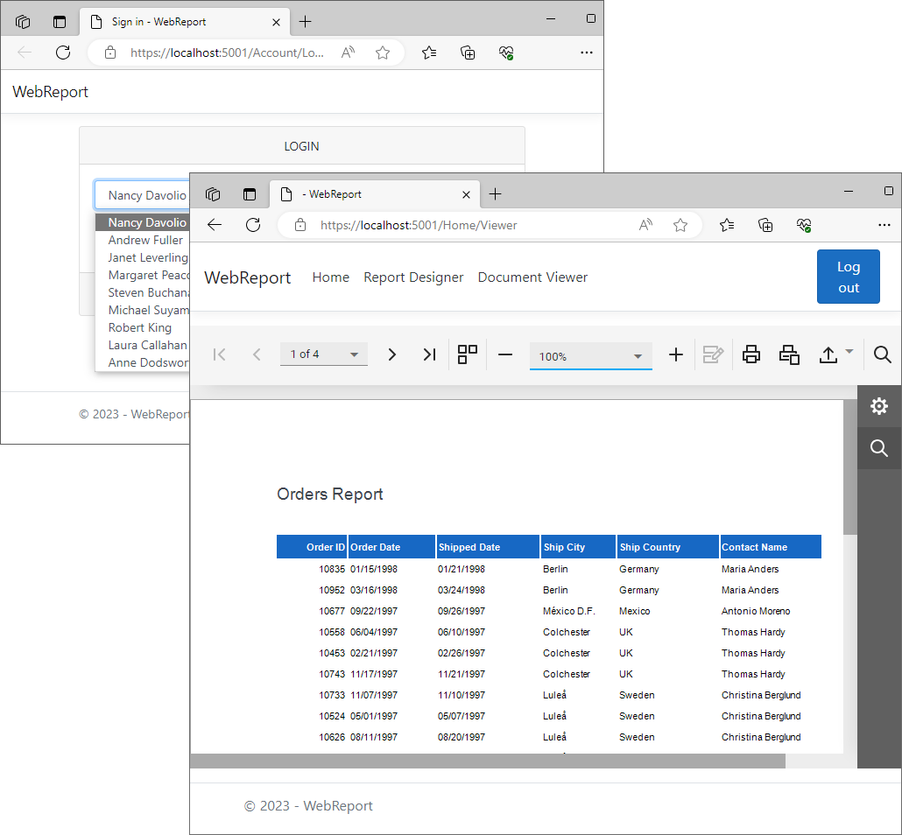

<!-- default badges list -->
[](https://supportcenter.devexpress.com/ticket/details/T1172357)
[](https://docs.devexpress.com/GeneralInformation/403183)
<!-- default badges end -->
# Reporting for ASP.NET Core - Implement Row-Level Security 

This example assumes that several users share the same database. The application sets the current user ID in [SESSION_CONTEXT](https://learn.microsoft.com/en-us/sql/t-sql/functions/session-context-transact-sql?view=sql-server-ver16&viewFallbackFrom=sql-server-ver16). Once the database connection opens, security policies filter rows that shouldn't be visible to the current user.

## Files to Review

- [RLSConnectionInterceptor.cs](./WebReportInterceptors/Services/RLSConnectionInterceptor.cs)
- [Program.cs](./WebReportInterceptors/Program.cs)
- [AccountController.cs](./WebReportInterceptors/Controllers/AccountController.cs)
- [Login.cshtml](./WebReportInterceptors/Views/Account/Login.cshtml)

## Example Overview

### Configure the Database

1. This example uses an SQL file ([instnwnd.sql](https://github.com/microsoft/sql-server-samples/blob/master/samples/databases/northwind-pubs/instnwnd.sql)). Execute it to recreate the database on your side. Do not forget to update [appsettings.json](./WebReportInterceptors/appsettings.json) to make the connection string valid in your environment.

2. Execute the script below. This script extends the database as follows:

   - Creates a new schema and predicate function that uses the user ID stored in SESSION_CONTEXT to filter rows. 
   - Creates a security policy that adds this function as a filter predicate and a block predicate on _Orders_.  

```sql
CREATE SCHEMA Security;
GO

CREATE FUNCTION Security.fn_securitypredicate(@EmployeeId int) 
    RETURNS TABLE
    WITH SCHEMABINDING
AS
    RETURN SELECT 1 AS fn_securitypredicate_result
    WHERE CAST(SESSION_CONTEXT(N'EmployeeId') AS int) = @EmployeeId;
GO

CREATE SECURITY POLICY Security.OrdersFilter
    ADD FILTER PREDICATE Security.fn_securitypredicate(EmployeeId)
        ON dbo.Orders,
    ADD BLOCK PREDICATE Security.fn_securitypredicate(EmployeeId)
        ON dbo.Orders AFTER INSERT
    WITH (STATE = ON);
GO
```

### Configure the `IDBConnectionInterceptor` Object 

Create an `IDBConnectionInterceptor` object ([RLSConnectionInterceptor.cs](./WebReportInterceptors/Services/RLSConnectionInterceptor.cs) in this example). During initialization, store the current user ID in SESSION_CONTEXT. Once the database connection opens, select rows from the _Orders_ table as needed.

Register `RLSConnectionInterceptor` as an extension in `IServiceCollection`.

### Run the Application

When you run the application, the registration form ([Login.cshtml](./WebReportInterceptors/Views/Account/Login.cshtml)) appears. Select a user to see the report with filtered data.



## More examples 

[Reporting for WinForms - Override the Default Isolation Level](https://github.com/DevExpress-Examples/winforms-reporting-interceptors)


